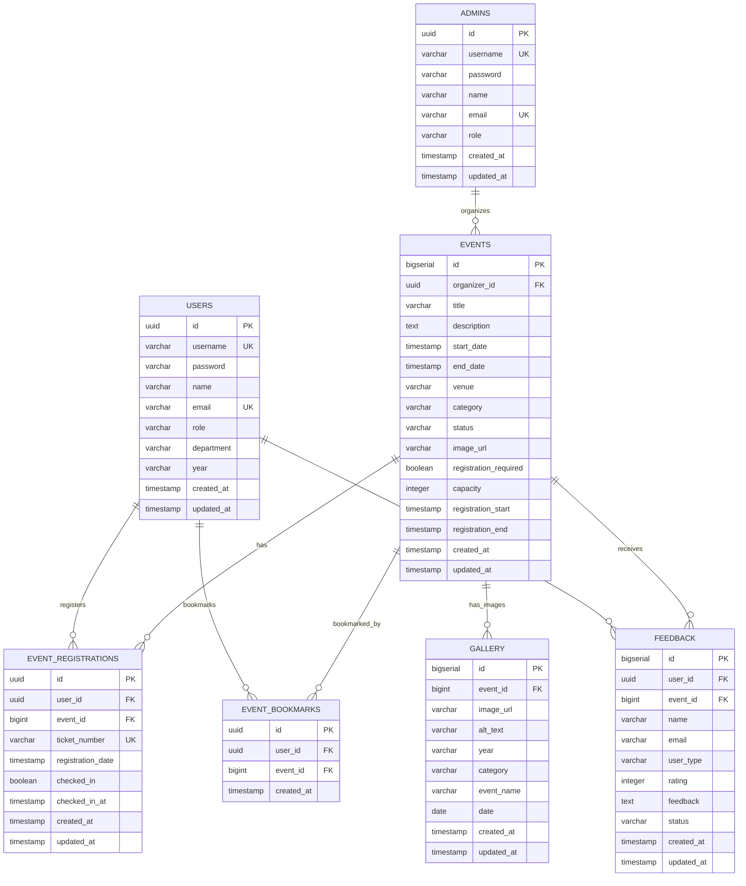

# Sơ đồ ERD - CampusConnect Database

## 📊 Entity Relationship Diagram (Mermaid)



---

## 🔗 Mối quan hệ Chi tiết

### 1. **USERS ↔ EVENTS** (Many-to-Many qua EVENT_REGISTRATIONS)

```
┌─────────┐                    ┌──────────────────────────┐                    ┌─────────┐
│  USERS  │───────1:N─────────│ EVENT_REGISTRATIONS     │────────N:1─────────│ EVENTS  │
└─────────┘                    └──────────────────────────┘                    └─────────┘
     │                                  │                                              │
     │                                  │                                              │
     │                                  │ PK: id (UUID)                                │
     │                                  │ FK: user_id → USERS.id                       │
     │                                  │ FK: event_id → EVENTS.id                      │
     │                                  │ UK: (user_id, event_id)                       │
     │                                  │                                               │
     └──────────────────────────────────┘                                               │
                                                                                        │
```

**Mô tả:**
- Một user có thể đăng ký nhiều events
- Một event có thể có nhiều users đăng ký
- Mỗi registration có ticket_number duy nhất
- Có thể check-in/check-out

---

### 2. **USERS ↔ EVENTS** (Many-to-Many qua EVENT_BOOKMARKS)

```
┌─────────┐                    ┌──────────────────┐                    ┌─────────┐
│  USERS  │───────1:N─────────│ EVENT_BOOKMARKS │────────N:1─────────│ EVENTS  │
└─────────┘                    └──────────────────┘                    └─────────┘
     │                                  │                                      │
     │                                  │ PK: id (UUID)                        │
     │                                  │ FK: user_id → USERS.id               │
     │                                  │ FK: event_id → EVENTS.id              │
     │                                  │ UK: (user_id, event_id)               │
     │                                  │                                       │
     └──────────────────────────────────┘                                       │
                                                                                  │
```

**Mô tả:**
- Một user có thể bookmark nhiều events
- Một event có thể được bookmark bởi nhiều users
- Mỗi user chỉ bookmark một event một lần

---

### 3. **ADMINS → EVENTS** (One-to-Many)

```
┌─────────┐                    ┌─────────┐
│  ADMINS │───────1:N─────────│ EVENTS  │
└─────────┘                    └─────────┘
     │                              │
     │                              │ FK: organizer_id → ADMINS.id
     │                              │ (ON DELETE SET NULL)
     │                              │
     └──────────────────────────────┘
```

**Mô tả:**
- Một admin có thể tổ chức nhiều events
- Một event chỉ có một organizer (admin/faculty)
- Nếu xóa admin, events vẫn giữ lại nhưng organizer_id = NULL

---

### 4. **EVENTS → GALLERY** (One-to-Many - Optional)

```
┌─────────┐                    ┌─────────┐
│ EVENTS  │───────1:N────────│ GALLERY │
└─────────┘                    └─────────┘
     │                              │
     │                              │ FK: event_id → EVENTS.id
     │                              │ (ON DELETE SET NULL)
     │                              │ (Nullable - có thể có ảnh không thuộc event)
     │                              │
     └──────────────────────────────┘
```

**Mô tả:**
- Một event có thể có nhiều hình ảnh trong gallery
- Một hình ảnh có thể không thuộc event cụ thể (event_id = NULL)
- Nếu xóa event, hình ảnh vẫn giữ lại nhưng event_id = NULL

---

### 5. **USERS → FEEDBACK** (One-to-Many)

```
┌─────────┐                    ┌─────────┐
│  USERS  │───────1:N─────────│ FEEDBACK│
└─────────┘                    └─────────┘
     │                              │
     │                              │ FK: user_id → USERS.id
     │                              │ (ON DELETE SET NULL)
     │                              │
     └──────────────────────────────┘
```

**Mô tả:**
- Một user có thể gửi nhiều feedback
- Một feedback thuộc về một user
- Nếu xóa user, feedback vẫn giữ lại nhưng user_id = NULL

---

### 6. **EVENTS → FEEDBACK** (One-to-Many)

```
┌─────────┐                    ┌─────────┐
│ EVENTS  │───────1:N─────────│ FEEDBACK│
└─────────┘                    └─────────┘
     │                              │
     │                              │ FK: event_id → EVENTS.id
     │                              │ (ON DELETE SET NULL)
     │                              │
     └──────────────────────────────┘
```

**Mô tả:**
- Một event có thể nhận nhiều feedback
- Một feedback thuộc về một event
- Nếu xóa event, feedback vẫn giữ lại nhưng event_id = NULL

---

## 📊 Tổng hợp Mối quan hệ

| Bảng 1        | Quan hệ | Bảng 2        | Bảng trung gian | Cardinality | FK Column        |
|---------------|---------|---------------|-----------------|-------------|------------------|
| USERS         | N:M     | EVENTS        | EVENT_REGISTRATIONS | Many-to-Many | user_id, event_id |
| USERS         | N:M     | EVENTS        | EVENT_BOOKMARKS | Many-to-Many | user_id, event_id |
| ADMINS        | 1:N     | EVENTS        | -               | One-to-Many | organizer_id     |
| EVENTS        | 1:N     | GALLERY       | -               | One-to-Many | event_id         |
| USERS         | 1:N     | FEEDBACK      | -               | One-to-Many | user_id          |
| EVENTS        | 1:N     | FEEDBACK      | -               | One-to-Many | event_id         |

---

## 🔑 Primary Keys Summary

| Bảng                | Primary Key | Type        | Generation Strategy |
|---------------------|-------------|-------------|---------------------|
| `users`             | `id`        | UUID        | uuid_generate_v4()  |
| `admins`            | `id`        | UUID        | uuid_generate_v4()  |
| `events`            | `id`        | BIGSERIAL   | Auto-increment      |
| `event_registrations` | `id`     | UUID        | uuid_generate_v4()  |
| `event_bookmarks`   | `id`        | UUID        | uuid_generate_v4()  |
| `gallery`           | `id`        | BIGSERIAL   | Auto-increment      |
| `feedback`          | `id`        | BIGSERIAL   | Auto-increment      |

---

## 🔗 Foreign Keys Summary

| Bảng                | Foreign Key Column | References Table | References Column | On Delete | On Update |
|---------------------|-------------------|------------------|------------------|-----------|-----------|
| `events`             | `organizer_id`    | `admins`         | `id`             | SET NULL  | CASCADE   |
| `event_registrations` | `user_id`      | `users`          | `id`             | CASCADE   | CASCADE   |
| `event_registrations` | `event_id`     | `events`         | `id`             | CASCADE   | CASCADE   |
| `event_bookmarks`   | `user_id`         | `users`          | `id`             | CASCADE   | CASCADE   |
| `event_bookmarks`   | `event_id`        | `events`         | `id`             | CASCADE   | CASCADE   |
| `gallery`            | `event_id`        | `events`         | `id`             | SET NULL  | CASCADE   |
| `feedback`           | `user_id`         | `users`          | `id`             | SET NULL  | CASCADE   |
| `feedback`           | `event_id`        | `events`         | `id`             | SET NULL  | CASCADE   |

---

## 📈 Indexes Summary

### Unique Indexes:
- `users.username` - UNIQUE
- `users.email` - UNIQUE
- `admins.username` - UNIQUE
- `admins.email` - UNIQUE
- `event_registrations.ticket_number` - UNIQUE
- `event_registrations(user_id, event_id)` - UNIQUE (Composite)
- `event_bookmarks(user_id, event_id)` - UNIQUE (Composite)

### Non-Unique Indexes:
- `users.role`
- `events.organizer_id`
- `events.category`
- `events.status`
- `events.start_date`
- `events(registration_start, registration_end)` - Composite
- `event_registrations.user_id`
- `event_registrations.event_id`
- `event_bookmarks.user_id`
- `event_bookmarks.event_id`
- `gallery.event_id`
- `gallery.year`
- `gallery.category`
- `feedback.user_id`
- `feedback.event_id`
- `feedback.status`
- `feedback.rating`
- `feedback.created_at`

---

## 🎯 Business Rules

### 1. **Registration Rules:**
- Một user chỉ có thể đăng ký một event một lần
- Ticket number phải unique
- Registration date tự động set khi đăng ký
- Check-in chỉ có thể thực hiện sau khi đăng ký

### 2. **Bookmark Rules:**
- Một user chỉ có thể bookmark một event một lần
- Bookmark có thể được thêm/xóa bất cứ lúc nào

### 3. **Event Rules:**
- Event phải có organizer (admin/faculty)
- End date phải >= start date
- Registration end date phải >= registration start date
- Status phải là một trong: incoming, upcoming, ongoing, completed, cancelled

### 4. **Feedback Rules:**
- Rating phải từ 1-5
- User type phải là: student, faculty, hoặc visitor
- Status phải là: active hoặc hidden

### 5. **Gallery Rules:**
- Category phải là: academic, cultural, sports, hoặc technical
- Event_id có thể NULL (ảnh không thuộc event cụ thể)

---

## 🔄 Data Flow Examples

### 1. **User đăng ký Event:**
```
1. User chọn event
2. Tạo record trong EVENT_REGISTRATIONS:
   - user_id = user.id
   - event_id = event.id
   - ticket_number = generate unique ticket
   - registration_date = NOW()
   - checked_in = false
3. Gửi email confirmation với ticket_number
```

### 2. **User bookmark Event:**
```
1. User click bookmark
2. Tạo record trong EVENT_BOOKMARKS:
   - user_id = user.id
   - event_id = event.id
   - created_at = NOW()
3. Nếu đã bookmark thì xóa record
```

### 3. **Admin tạo Event:**
```
1. Admin tạo event
2. Tạo record trong EVENTS:
   - organizer_id = admin.id
   - title, description, dates, etc.
   - status = 'upcoming'
3. Event có thể được users đăng ký/bookmark
```

### 4. **User gửi Feedback:**
```
1. User gửi feedback sau khi tham dự event
2. Tạo record trong FEEDBACK:
   - user_id = user.id
   - event_id = event.id
   - rating, feedback text
   - status = 'active'
3. Feedback có thể được admin ẩn (status = 'hidden')
```

---

## 📝 Notes

1. **UUID vs BIGSERIAL:**
   - UUID cho users, admins, registrations, bookmarks (security, globally unique)
   - BIGSERIAL cho events, gallery, feedback (performance, readability)

2. **CASCADE vs SET NULL:**
   - CASCADE: Xóa user/event → xóa registrations/bookmarks
   - SET NULL: Xóa admin/event → giữ feedback/gallery nhưng set FK = NULL

3. **Timestamps:**
   - `created_at`: Set khi tạo record
   - `updated_at`: Auto-update khi có thay đổi (via trigger)

4. **Constraints:**
   - CHECK constraints đảm bảo data integrity
   - UNIQUE constraints đảm bảo không trùng lặp
   - NOT NULL cho required fields

---

**Xem chi tiết SQL schema trong file:** `DATABASE_SCHEMA.md`

*Last Updated: [Date]*
*Version: 1.0*

